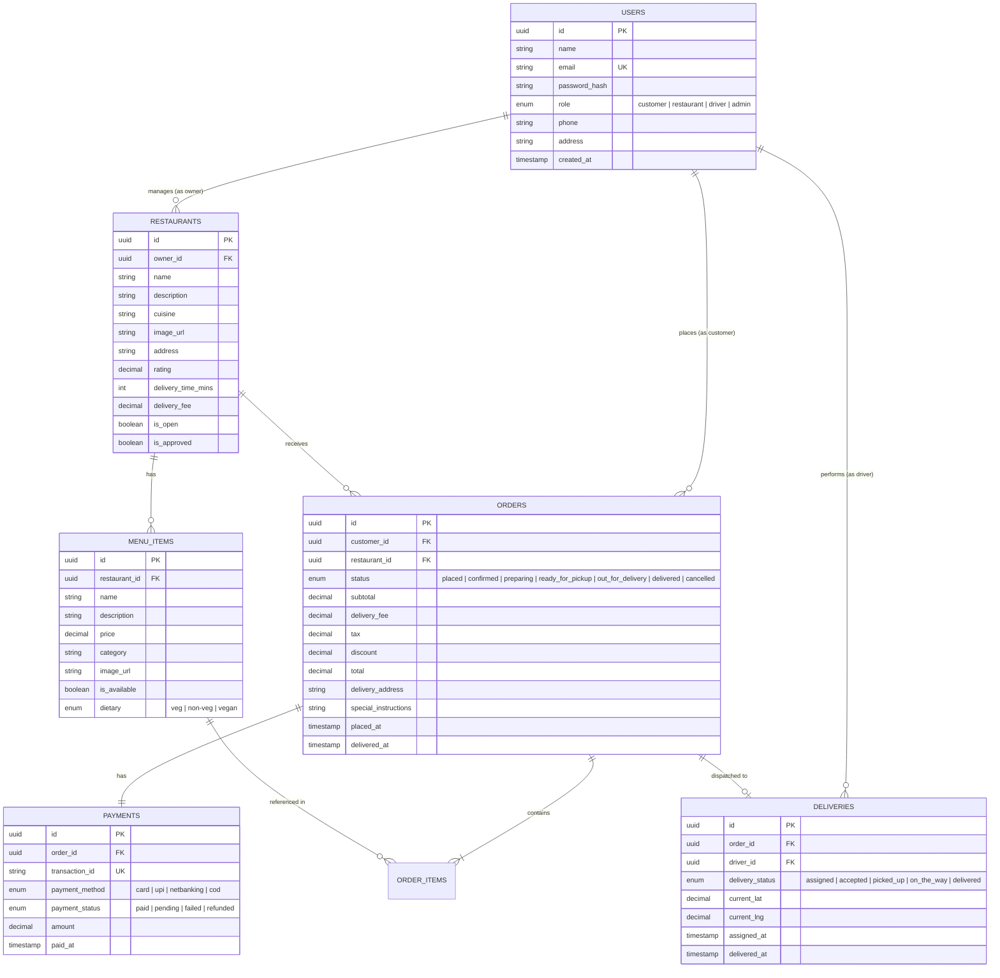

# Central Backend Implementation Plan (Phase 1)

This plan outlines the architecture, database schema, mock payment gateway, and API endpoints for the **Central Backend** of the Customer Food Order Management System on branch `feature_v1.0`.

---

## 1. Backend Architecture & Tech Stack

- **Runtime**: Node.js & Express.js
- **Database**: **PostgreSQL** (with relational schema, migration scripts, and seed fixtures; dual-mode connection with graceful dev fallback)
- **Real-Time Communication**: `Socket.io` (WebSockets) for instant multi-role state propagation
- **Payment Processing**: **Mock Payment Gateway Engine** (Card, UPI / QR, Net Banking, COD)
- **Security & Middleware**: `cors`, `helmet`, `morgan`, JWT authentication & role-based access control (`customer`, `restaurant`, `driver`, `admin`)

---

## 2. PostgreSQL Relational Schema

---

## 3. Core Modules & Endpoints

### 💳 Mock Payment Gateway (`/api/payments`)
- `POST /api/payments/process`
  - Accepts payment details: method (`card`, `upi`, `netbanking`, `cod`), mock card/UPI info, and order amount.
  - Simulates payment approval / 3D Secure verification instantly.
  - Generates unique mock `transaction_id` (e.g., `TXN_MOCK_89427492`), records payment record, and updates order status to `paid`.
- `GET /api/payments/:orderId` - Retrieve payment transaction receipt.

### 🔐 Auth & Role Management (`/api/auth`)
- `POST /api/auth/register` - Register customer, restaurant owner, or driver.
- `POST /api/auth/login` - Authenticate with email/password.
- `GET /api/auth/me` - Retrieve user profile & active role.
- `GET /api/auth/demo-users` - Preloaded 1-click test credentials for all 4 roles.

### 🍔 Restaurants & Menu Management (`/api/restaurants` & `/api/menu`)
- `GET /api/restaurants` - List restaurants with filters (cuisine, rating, status).
- `GET /api/restaurants/:id` - Get restaurant with full menu.
- `POST /api/restaurants` - Onboard restaurant (Admin/Owner).
- `PUT /api/restaurants/:id` - Update restaurant info, toggle open/closed.
- `POST /api/menu/:restaurantId` - Add dish to menu.
- `PUT /api/menu/:restaurantId/:itemId` - Update dish or toggle availability.
- `DELETE /api/menu/:restaurantId/:itemId` - Remove dish.

### 📦 Order Lifecycle Engine (`/api/orders`)
- `POST /api/orders` - Place new order (calculates totals, creates mock payment entry).
- `GET /api/orders` - List orders by role (Customer history, Restaurant active queue, Admin master list).
- `GET /api/orders/:id` - Order details, item breakdown, invoice, and timestamp trail.
- `PATCH /api/orders/:id/status` - Advance lifecycle: `placed` ➔ `confirmed` ➔ `preparing` ➔ `ready_for_pickup` ➔ `out_for_delivery` ➔ `delivered`.

### 🛵 Delivery Partner Dispatch (`/api/deliveries`)
- `GET /api/deliveries/available` - List orders ready for pickup.
- `POST /api/deliveries/:orderId/accept` - Driver accepts order.
- `PATCH /api/deliveries/:orderId/status` - Update delivery stage (`picked_up`, `on_the_way`, `delivered`).
- `POST /api/deliveries/location` - Stream driver coordinates for live map tracking.
- `PATCH /api/deliveries/toggle-status` - Toggle driver online/offline.

### 🛡️ Admin Management & Analytics (`/api/admin`)
- `GET /api/admin/stats` - Platform KPIs: total revenue, commission, active orders, driver count.
- `GET /api/admin/users` - Manage registered users & roles.
- `PATCH /api/admin/restaurants/:id/approve` - Approve/verify restaurants.
- `PATCH /api/admin/drivers/:id/approve` - Approve/verify delivery drivers.

---

## 4. Real-Time Socket.io Events

| Event Name | Emitter | Audience | Description |
| :--- | :--- | :--- | :--- |
| `order:created` | Customer | Restaurant & Admin | Notifies restaurant of new incoming order (with chime alert) |
| `payment:success` | Backend | Customer & Restaurant | Confirms mock payment clearance |
| `order:status_changed` | Restaurant / Driver / Admin | Customer, Restaurant, Driver, Admin | Updates live progress bar in real-time |
| `delivery:task_ready` | Restaurant | Online Drivers | Alerts drivers when food is `ready_for_pickup` |
| `delivery:assigned` | Driver | Customer & Restaurant | Informs customer and restaurant which driver accepted the trip |
| `delivery:location_update` | Driver | Customer | Streams driver GPS coordinates for live map tracking |

---

## 5. Verification Plan

### Automated Backend Verification:
- Run automated end-to-end test suite (`node tests/api.test.js`):
  1. Verify Auth & Demo accounts for all 4 roles.
  2. Verify Restaurant & Menu CRUD.
  3. Verify Order creation + Mock Payment processing (Card / UPI / COD).
  4. Verify Order lifecycle progression & Delivery dispatch.
  5. Verify Admin stats & analytics.
  6. Verify Socket.io event emissions.

### Checkpoint:
- Share test verification report with you.
- Request your permission before starting the frontend portals.
